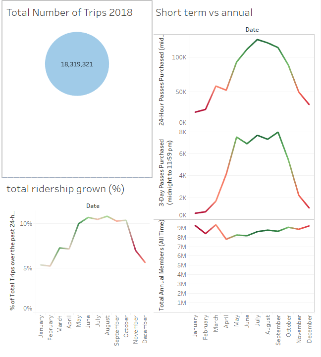
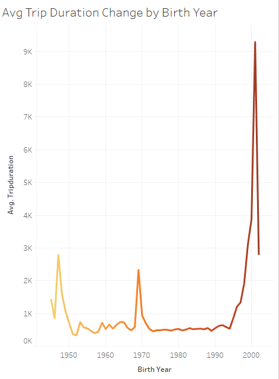
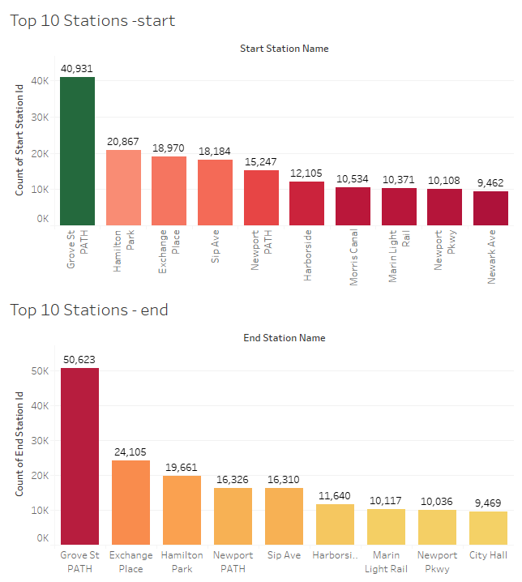
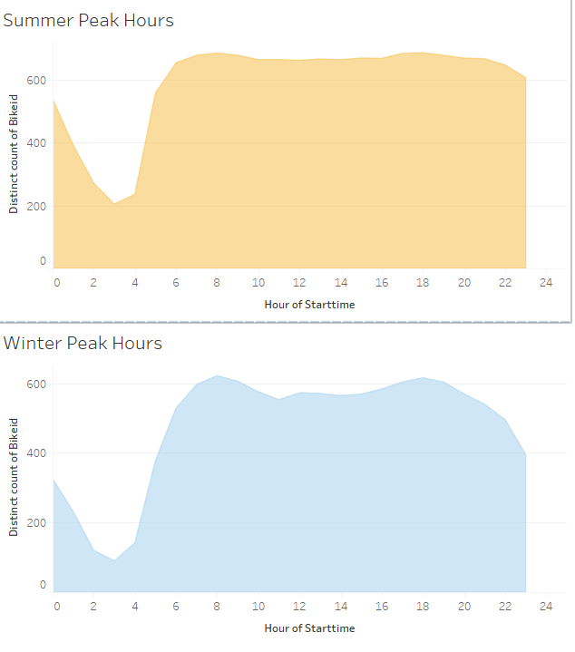

# Tableau-Assignment---Citi-Bike-Analytics

Findings from plotting the Data for the Jersey City obtained from the Citi Bike Public website.

More then 18 million trips have been completed in 2018 with ridership growing with the increase in 
temperatue of the city and reaching its peak during the summer months of July & August.
Since NYC is a popular tourist destination 24 hour passes are being purchased which also shows a steep increase with 
the improvement of the weather.
The Total Annual membership seems to decline during the peak winter months and shows a steady increase during the following months
when the weather improves.

This above line graph shows the Average Trip duration is higher for the younger demographics who take more and longer trips compared
to the older demographics.

Grove Path station is a popular start and end point in Jersey City due to commuters living in Jersey City parking their bikes and taking the train to NYC and vice versa after returning back from NYC commueters take the bikes to ride back home.

